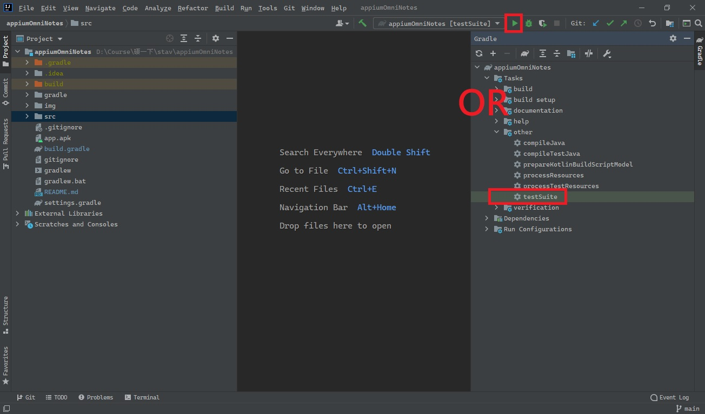

# appiumOmniNotes

## Features to be tested
* [x] TC-01
* [x] TC-02
* [x] TC-03
* [x] TC-04
* [x] TC-05
* [x] TC-06
* [x] TC-07
* [x] TC-08
* [x] TC-09
* [x] TC-10
* [x] TC-11
* [x] TC-12
* [x] TC-13
* [ ] TC-14 // 先不用做
* [ ] TC-15 // 先不用做
* [x] TC-16
* [x] TC-17
* [x] TC-18
* [x] TC-19
* [x] TC-20
* [x] TC-21
* [x] TC-22
* [x] TC-23
* [x] TC-24
* [x] TC-25
* [x] TC-26
* [x] TC-27//增加布林不知要不要再測
* [x] TC-28

## ADB Command
```
adb shell am start -n it.feio.android.omninotes/.MainActivity
adb shell am start -n it.feio.android.omninotes/.intro.IntroActivity
```

## Pre-preparation
Open ntut.csie.team3.AbstractTest.java
```
...
public final static String DEVICE_NAME = "???";
...
```
modify "???" to your device name.

## Run

